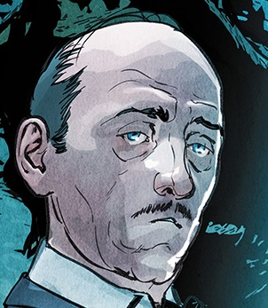

# Alfred - Discord Bot
[](https://github.com/Macro303/Alfred/releases)
[](https://github.com/Macro303/Alfred/issues)
[](https://github.com/Macro303/Alfred/graphs/contributors)
[](https://opensource.org/licenses/MIT)

[Bot invite link](https://discord.com/api/oauth2/authorize?client_id=801552931505700884&permissions=67464256&scope=bot)

## Built Using
 - [Python: 3.9.2](https://www.python.org/)
 - [pip: 21.0.1](https://pypi.org/project/pip/)
 - [PyYAML: 5.4.1](https://pypi.org/project/PyYAML/)
 - [discord.py: 1.6.0](https://pypi.org/project/discord.py/)
 - [pony: 0.7.14](https://pypi.org/project/pony/)
 - [requests: 2.25.1](https://pypi.org/project/requests)
 - [beautifulsoup4: 4.9.3](https://pypi.org/project/beautifulsoup4)

## Execution
1. Execute the following to generate the default files:
   ```bash
   $ pip install -r requirements.txt
   $ python -m Bot --init-db
   ```
2. Update the generated `config.yaml` with your Discord Token and preferred Prefix
3. Run the following:
   ```bash
   $ python -m Bot
   ```

## Socials
[](https://discord.gg/nqGMeGg)  